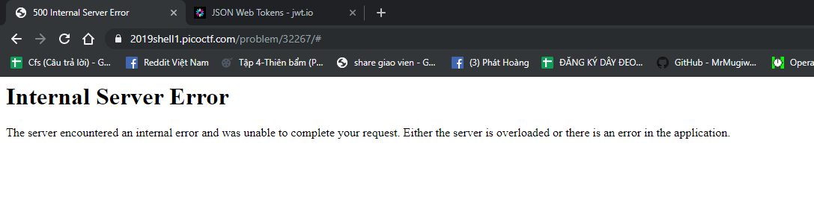
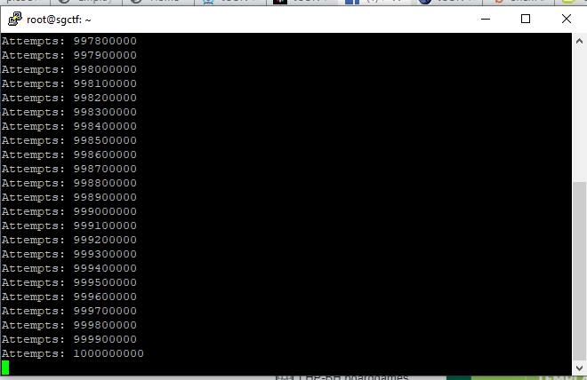
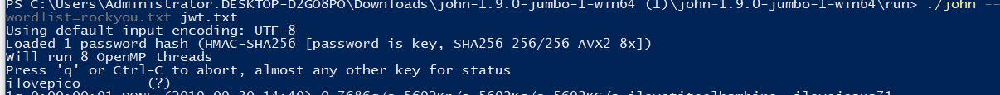
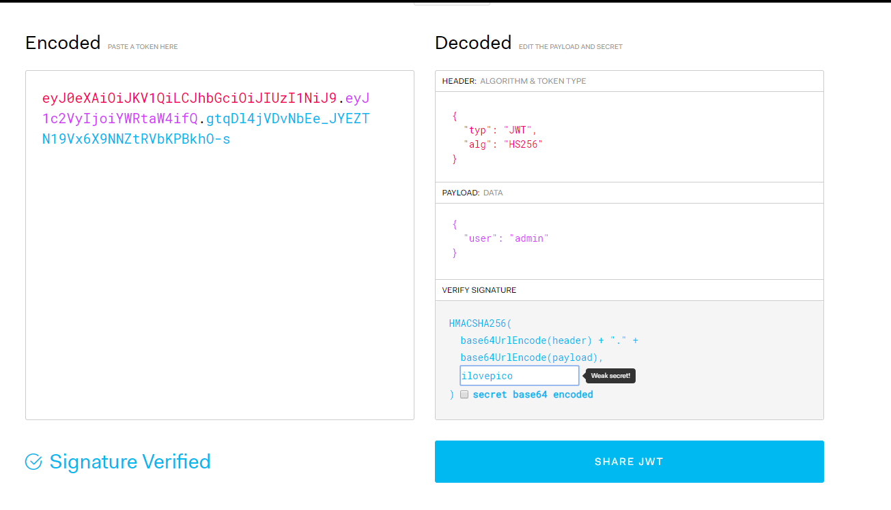
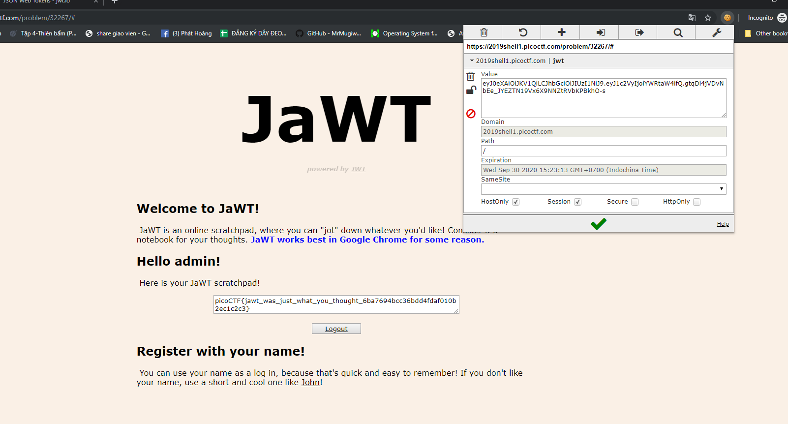

Đầu tiên mở test lên thì mình thấy nó cho 1 field điền username và không được điền admin. Mình thử username là iloveyou

Trang web nó có 1 cái cookie tên là jwt và dữ liệu nhìn giống base64

Trong trang web có gợi ý về jwt.io, mình mở trang jwt.io lên . Nó có phần cho dán cái gì đó, thế mình dán cái nội dung trong cookie thử

JWT là 1 loại mã, gồm phần đầu ( header) cho biết thuật toán mã hóa , phần thân (payload) cho ta biết nội dung như username và phần cuối là phần chữ ký (sign) để đảm bảo cho 2 phần trên không bị sửa đổi 
Mục tiêu của mình là: đăng nhập vào với tư cách admin, và vì mình không thể nhập admin trên trang đăng nhập, mình sẽ phải làm cách nào đó để hệ thống biết mình là admin.
Nhìn vào cái **user: iloveyou**, mình có  ý tưởng là thay nó thành admin, và copy đoạn bên trái thay cho cookie hồi nãy. 

Nhưng nó báo lỗi :) 

Ủa thế sai ở chỗ nào nhỉ?
Nhớ ở trên có nói về phần chữ kí không? Mình vẫn chưa biết **mật khẩu** phần chữ kí như thế nào ( phần khoanh đỏ) nên nó báo invaild. Nhưng lúc đổi **user** thành **admin** thì vô tình làm đổi cái mât khẩu luôn rồi :'< 

Bực quá , lúc này là 1h đêm, ngủ xong mai tính tiếp
=============================================================

Rồi, sau khi dậy trễ và cúp NMLT :< thì mình có ý tưởng là bẻ khóa cái đoạn sign của cookie, và thử 1  tool nhưng đến 1 tỷ lần thử vẫn không được.

Rồi mình mò đến John the Ripper, một tool nổi tiếng  thì bẻ khóa thành công :) 
Sau đây là những bước crack thành công : 
1. quay lại trang problem, xóa hết cookie,đăng nhập lại, và lấy lại cái cookie, lưu thành file text ( mình đặt là jwt.txt) 

2. Tải John the ripper trên mạng, và tải wordlist "rockyou.txt" 

3. chạy John the ripper với câu lệnh sau: **./john --wordlist=rockyou.txt jwt.txt**

4: quay qua uống miếng nước và tadaaaa, đã có cái password rồi nè, nó là **ilovepico**

5. Quay lại jwt.io, dán cái cookie vào phía bên trái, thay cái **your-256-bit-secret** thành **ilovepico**, đổi cái username thành **admin**

6. copy hết đống bên trái vào cookie editor trên trang problem và F5 lại, thế là có Flag

